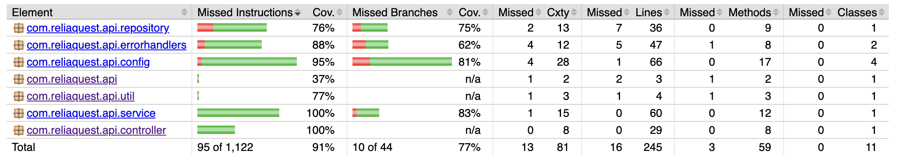

# Getting Started

## Overview
This is a REST API service built using Spring Boot and Gradle. It provides various endpoints for managing employees.

## Prerequisites
- Java 11+
- Gradle 7+
- Docker (for MockServer and Testcontainers)

## Running the API Service
To start the service, run the following command:

```sh
./gradlew bootRun
```

## Accessing Swagger UI
Once the service is running, you can access the Swagger UI at:

```
http://localhost:8111/swagger-ui/index.html
```

## Running Tests and Checking Coverage

To run tests and generate a test coverage report, use:

```sh
./gradlew test jacocoTestReport
```

The coverage report will be available in:
```
build/reports/jacoco/test/html/index.html

```

## Building the Project
To build the project, execute:

```sh
./gradlew build
```

## Docker Support
To run the application with Docker:

```sh
docker build -t api-service .
docker run -p 8111:8111 api-service
```

## Environment Variables
| Variable | Description | Default |
|----------|-------------|---------|
| `SERVER_PORT` | Port for the application | `8111` |
| `MOCKSERVER_URL` | URL of the mock server | `http://localhost:8112` |
